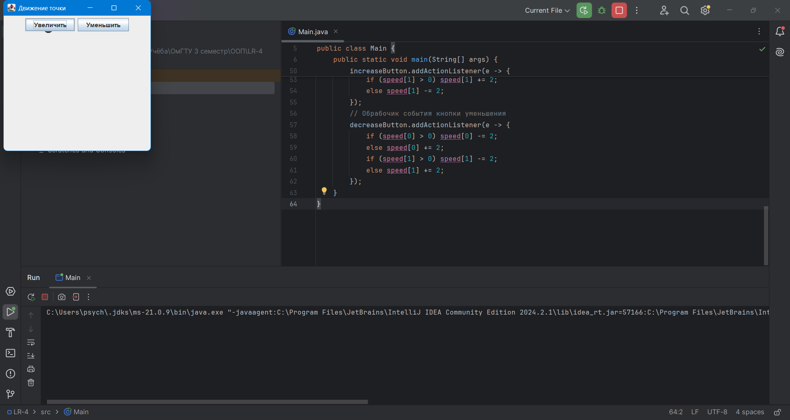

# Лабораторная работа №4
По дисциплине "Объектно-ориентированное проограммирование", 3 семестр.

Выполнила студентка группы ПИН-232 Корноухова Маргарита.

**Вариант 8.** Составить программу для управления скоростью движения точки по апплету. Одна кнопка увеличивает скорость, другая – уменьшает. Каждый щелчок изменяет скорость на определенную величину.

